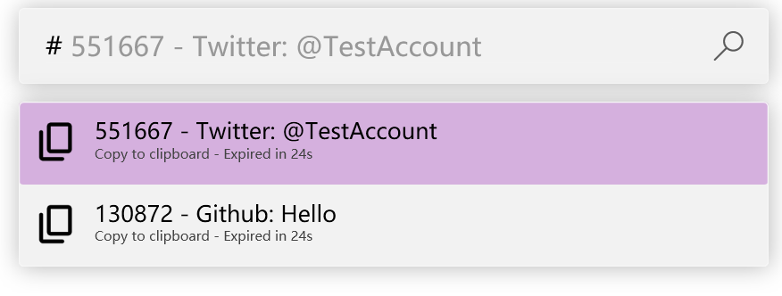

# Powertoys Run TOTP Plugin
A plugin helps you to copy your two-factor verification code in Powertoys Run


## Screenshot


## Installation
1. Download plugin from Release
2. Extract it to `%LOCALAPPDATA%\Microsoft\PowerToys\PowerToys Run\Plugins`

## Upgrade
1. Download plugin from Release
2. Delete `%LOCALAPPDATA%\Microsoft\PowerToys\PowerToys Run\Plugins\TOTP` (Will not lose any data)
3. Extract it to `%LOCALAPPDATA%\Microsoft\PowerToys\PowerToys Run\Plugins`

## Usage
1. Add account  
Plugin support standard OTPAuth URI (starts with `otpauth://`) and Google Authenticator Export URI(starts with `otpauth-migration://`), you can paste it to the PT Run input bar and you will see an option to add it to list.  
You can use any QRCode scanner to resolve QRCode to link, Accounts with same key in the list will not be added.  
You can also add manually by editing config file in `%LOCALAPPDATA%\Microsoft\PowerToys\PowerToys Run\Settings\Plugins\TOTP\Config.json`:
    ```json
    [
      {
        "Name": "Github: Hello",
        "Key": "12313",
        "IsEncrypted": false
      },
      {
        "Name": "Twitter: @Hello",
        "Key": "12313213",
        "IsEncrypted": false
     }
    ]
    ```
    Change to the config file will be applied immediately.  
    Once the plugin loads the config again, **all unencrypted data will be encrypted**.

2. Delete account  
There is no way to delete accounts by GUI.   
You delete an account by editing the config file in `%LOCALAPPDATA%\Microsoft\PowerToys\PowerToys Run\Settings\Plugins\TOTP\Config.json`.
Change to the config file will be applied immediately.


## About Encryption
Plugin uses `System.Security.Cryptography.ProtectedData` to encrypt every key. All keys will be decrypted in memory if needed.  
Encrypted data only can be decrypted in your current machine with the current account login, if you reinstall the OS or change the account you log in to, the key cannot be decrypted.

## Build Plugin
1. Clone repo
2. Use "Publish" to build plugin and copy dependencies
3. Use `ILRepack` to bundle all dependencies to a single file(Powertoys doesn't support load dll by the PTRun plugin).
   ```
    ILRepack.exe /lib:"C:\Program Files\Microsoft Visual Studio\2022\Community\dotnet\runtime\shared\Microsoft.NETCore.App\6.0.16" /lib:"C:\Users\(yourself)\.nuget\packages" /out:PowerToysRunTOTP.dll PowertoysRunTOTP\bin\Release\net6.0-windows\publish\win-x64\PowerToysRunTOTP.dll
   ```
4. Use ILRepack to generate `PowerToysRunTOTP.dll` to replace the original output.
